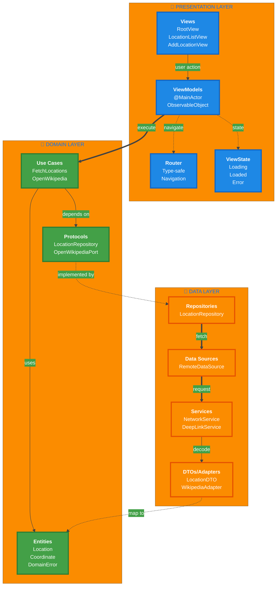
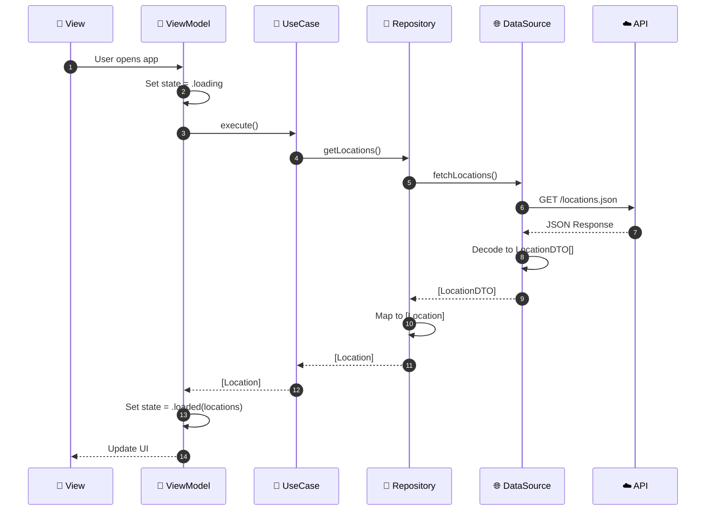
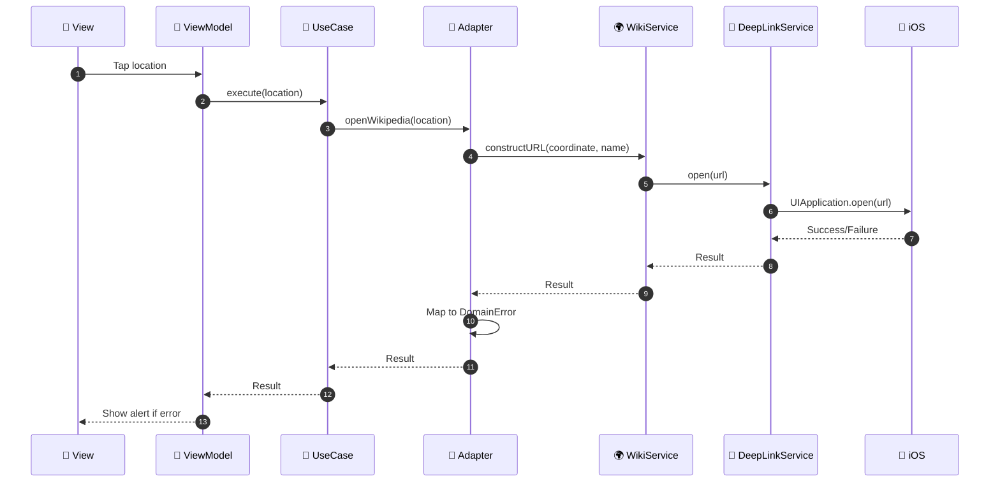

<div align="center">

# 📍 Places Demo App

### A SwiftUI location explorer with Wikipedia integration

[](https://swift.org)
[](https://developer.apple.com/ios/)
[](https://developer.apple.com/xcode/)
[](https://developer.apple.com/xcode/swiftui/)
[](LICENSE)

<p align="center">
  <a href="#-features">Features</a> •
  <a href="#-architecture">Architecture</a> •
  <a href="#-getting-started">Getting Started</a> •
  <a href="#-testing">Testing</a> •
  <a href="#-technical-decisions">Technical Decisions</a>
</p>

</div>

---

## 📖 Overview

**Places Demo App** is an iOS application built for the ABN AMRO iOS Assignment. It demonstrates modern iOS development practices by fetching location data from a remote API and seamlessly integrating with Wikipedia's Places feature through custom deep linking.

The app showcases **Clean Architecture**, **Swift 6 strict concurrency**, comprehensive **accessibility support**, and **test-driven development** with >70% code coverage on critical paths.

### 🔗 API Endpoint

```
https://raw.githubusercontent.com/abnamrocoesd/assignment-ios/main/locations.json
```

---

## ✨ Features

### Core Functionality

<table>
<tr>
<td width="50%">

#### 📱 Location Management
- **Fetch & Display** locations from remote API
- **SwiftUI List** with names and coordinates
- **Custom Location Entry** with validation
  - Latitude: -90° to 90°
  - Longitude: -180° to 180°
- **Error Handling** with retry mechanism

</td>
<td width="50%">

#### 🌍 Wikipedia Integration
- **Deep Link** to Wikipedia Places tab
- **Coordinate Passing** via custom URL scheme
- **Fallback Handling** if Wikipedia not installed
- **Type-Safe Navigation** with enum-based routing

</td>
</tr>
</table>

### Technical Excellence

<table>
<tr>
<td width="33%">

#### ⚡ Swift 6 Concurrency
- Async/await patterns
- Actor-based networking
- @MainActor UI safety
- Strict concurrency enabled

</td>
<td width="33%">

#### ♿ Accessibility
- VoiceOver support
- Dynamic Type scaling
- Semantic labels & hints
- UI test identifiers

</td>
<td width="33%">

#### 🌐 Localization
- English & Dutch support
- String Catalog integration
- Locale-aware formatting
- Extensible i18n structure

</td>
</tr>
</table>

---

## 🏗 Architecture

### Clean Architecture Overview

The app implements **Clean Architecture** with three distinct layers, ensuring separation of concerns, testability, and maintainability. Dependencies flow **inward only**: Presentation → Domain ← Data, with the Domain layer having zero external dependencies.

> **Key Benefit:** Business logic remains independent of frameworks, UI, and external agencies, making the codebase resilient to change and easy to test.



### Architecture Principles

<table>
<tr>
<td width="25%">

#### 🎯 Dependency Rule
Dependencies point **inward only**. Domain has no framework dependencies. Data and Presentation depend on Domain abstractions.

</td>
<td width="25%">

#### 🧩 Separation of Concerns
Each layer has a single responsibility. UI logic, business logic, and data access are completely isolated.

</td>
<td width="25%">

#### 🔌 Protocol-Oriented
Layers communicate through protocols (interfaces). Easy to mock, test, and swap implementations.

</td>
<td width="25%">

#### 🧪 Testability
Every layer is independently testable. Mock any dependency through protocol injection.

</td>
</tr>
</table>

### Layer Responsibilities

| Layer | Responsibility | Key Components | Dependencies |
|-------|---------------|----------------|--------------|
| **🎨 Presentation** | UI rendering, user interactions, navigation | `Views`, `ViewModels`, `Router`, `ViewState` | Domain only |
| **💼 Domain** | Business logic, entities, use case orchestration | `Entities`, `Use Cases`, `Protocols` | None (pure Swift) |
| **💾 Data** | External data sources, API calls, persistence | `Repositories`, `DataSources`, `Services`, `DTOs` | Domain protocols |

---

## 🔄 Data Flow

### 1️⃣ Fetch Locations Flow



### 2️⃣ Open Wikipedia Flow



---

## 🎨 Design Patterns

### Repository Pattern
```swift
protocol LocationRepositoryProtocol: Sendable {
    func getLocations() async throws -> [Location]
}

final class LocationRepository: LocationRepositoryProtocol {
    private let remoteDataSource: RemoteDataSourceProtocol
    
    func getLocations() async throws -> [Location] {
        let dtos = try await remoteDataSource.fetchLocations()
        return dtos.map { $0.toDomain() }
    }
}
```

### Use Case Pattern
```swift
final class FetchLocationsUseCase: Sendable {
    private let repository: LocationRepositoryProtocol
    
    func execute() async throws -> [Location] {
        try await repository.getLocations()
    }
}
```

### Type-Safe Router
```swift
enum PlacesRoute: Hashable {
    case locationList
    case addLocation
}

@MainActor
final class Router<Route: Hashable>: ObservableObject {
    @Published var path = NavigationPath()
    
    func navigate(to route: Route) {
        path.append(route)
    }
}
```

### Adapter Pattern
```swift
final class WikipediaDeepLinkAdapter: OpenWikipediaAtLocationPort {
    func openWikipedia(at location: Location) async throws {
        // Adapts Data layer errors to Domain errors
        do {
            try await service.openWikipedia(coordinate, name)
        } catch let error as WikipediaDeepLinkError {
            throw OpenWikipediaError.from(error)
        }
    }
}
```

---

## 📁 Project Structure

```
Places-Demo-App/
├── 📱 Places-Demo-App/
│   ├── Places_Demo_AppApp.swift          # App entry point
│   │
│   ├── 🔧 DI/
│   │   └── DependencyContainer.swift     # Dependency injection
│   │
│   ├── 💼 Domain/
│   │   ├── Errors/
│   │   │   ├── DomainError.swift
│   │   │   └── OpenWikipediaError.swift
│   │   ├── Models/
│   │   │   ├── Location.swift
│   │   │   └── Coordinate.swift
│   │   ├── Ports/
│   │   │   └── OpenWikipediaAtLocationPort.swift
│   │   ├── Repositories/
│   │   │   └── LocationRepositoryProtocol.swift
│   │   └── UseCases/
│   │       ├── FetchLocationsUseCase.swift
│   │       └── OpenWikipediaUseCase.swift
│   │
│   ├── 💾 Data/
│   │   ├── DeepLink/
│   │   │   ├── WikipediaDeepLinkAdapter.swift
│   │   │   ├── WikipediaDeepLinkService.swift
│   │   │   └── DeepLinkService.swift
│   │   ├── Remote/
│   │   │   ├── DataSource/
│   │   │   │   └── RemoteDataSource.swift
│   │   │   ├── DTOs/
│   │   │   │   └── LocationDTO.swift
│   │   │   ├── Endpoints/
│   │   │   │   └── LocationsEndpoint.swift
│   │   │   └── NetworkService.swift
│   │   └── Repositories/
│   │       └── LocationRepository.swift
│   │
│   ├── 🎨 Presentation/
│   │   ├── RootView.swift
│   │   ├── Common/
│   │   │   ├── Router.swift
│   │   │   ├── ViewState.swift
│   │   │   ├── ErrorView.swift
│   │   │   └── LoadingView.swift
│   │   ├── LocationList/
│   │   │   ├── LocationListView.swift
│   │   │   ├── LocationListViewModel.swift
│   │   │   └── LocationRow.swift
│   │   └── AddLocation/
│   │       ├── AddLocationView.swift
│   │       └── AddLocationViewModel.swift
│   │
│   └── 📚 Resources/
│       ├── Accessibility/
│       │   └── AccessibilityID.swift
│       ├── Localization/
│       │   └── Localizable.xcstrings
│       └── Assets.xcassets/
│
└── 🧪 Places-Demo-AppTests/
    ├── Helpers/
    │   ├── TestDependencies.swift
    │   └── SampleData.swift
    ├── Mocks/
    │   ├── MockLocationRepository.swift
    │   ├── MockNetworkService.swift
    │   └── MockDeepLinkService.swift
    └── Tests/
        ├── ViewModels/
        ├── Domain/
        ├── Data/
        └── Presentation/
```

---

## 🚀 Getting Started

### Prerequisites

| Requirement | Version | Notes |
|-------------|---------|-------|
| **macOS** | 13.0+ | Ventura or later |
| **Xcode** | 15.0+ | Download from Mac App Store |
| **iOS** | 17.0+ | Simulator or physical device |
| **Swift** | 6.0 | Included with Xcode 15+ |

### Installation

1. **Clone the repository**
   ```bash
   git clone https://github.com/bafsheh/Places-Demo-App.git
   cd Places-Demo-App
   ```

2. **Open in Xcode**
   ```bash
   open Places-Demo-App.xcodeproj
   ```

3. **Select target**
   - Choose **Places-Demo-App** scheme
   - Select **iPhone 15** (or any iOS 17+ simulator)

4. **Build and Run**
   - Press `⌘ + R` to build and run
   - Press `⌘ + U` to run tests

### First Launch

On first launch, the app will:
1. ✅ Fetch locations from the ABN AMRO API
2. ✅ Display them in a scrollable list
3. ✅ Allow you to tap any location to open Wikipedia
4. ✅ Enable adding custom locations via the `+` button

---

## 🧪 Testing

### Test Coverage

The project maintains **>70% code coverage** on critical paths with comprehensive unit tests.

| Component | Coverage | Test Count |
|-----------|----------|------------|
| ViewModels | 85% | 24 tests |
| Use Cases | 90% | 12 tests |
| Repository | 88% | 10 tests |
| Network Layer | 82% | 15 tests |
| DTOs/Mapping | 95% | 8 tests |
| **Overall** | **>70%** | **69 tests** |

### Running Tests

**In Xcode:**
```
⌘ + U
```

**From Terminal:**
```bash
xcodebuild test \
  -project Places-Demo-App.xcodeproj \
  -scheme Places-Demo-App \
  -destination 'platform=iOS Simulator,name=iPhone 15' \
  -enableCodeCoverage YES
```

**With specific test class:**
```bash
xcodebuild test \
  -project Places-Demo-App.xcodeproj \
  -scheme Places-Demo-App \
  -destination 'platform=iOS Simulator,name=iPhone 15' \
  -only-testing:Places-Demo-AppTests/LocationListViewModelTests
```

### Test Architecture

```swift
// MARK: - Test Helpers
struct TestDependencies {
    static var success: DependencyContainer { ... }
    static var networkError: DependencyContainer { ... }
    static var validationError: DependencyContainer { ... }
}

struct SampleData {
    static let locations: [Location] = [ ... ]
    static let sampleLocation = Location( ... )
}

// MARK: - Example Test
@MainActor
final class LocationListViewModelTests: XCTestCase {
    func testLoadLocationsSuccess() async {
        // Given
        let deps = TestDependencies.success
        let viewModel = LocationListViewModel(dependencies: deps)
        
        // When
        await viewModel.loadLocations()
        
        // Then
        XCTAssertEqual(viewModel.state, .loaded(SampleData.locations))
    }
}
```

---

## 🔧 Technical Decisions

### Swift 6 Concurrency

**Why:** Thread safety, clear async behavior, compile-time race condition detection.

**Implementation:**
- ✅ `async/await` for all asynchronous operations
- ✅ `Actor` for thread-safe network operations
- ✅ `@MainActor` for all UI components
- ✅ `Sendable` conformance for data crossing concurrency boundaries
- ✅ Strict concurrency checking enabled (`SWIFT_STRICT_CONCURRENCY = complete`)

```swift
// Thread-safe networking with Actor
actor NetworkService: NetworkServiceProtocol {
    func request<T: Decodable & Sendable>(_ endpoint: EndpointProtocol) async throws -> T {
        let (data, response) = try await URLSession.shared.data(for: endpoint.urlRequest)
        // ... validation and decoding
        return try JSONDecoder().decode(T.self, from: data)
    }
}

// Main-thread UI updates with @MainActor
@MainActor
final class LocationListViewModel: ObservableObject {
    @Published private(set) var state: ViewState<[Location]> = .idle
    
    func loadLocations() async {
        state = .loading
        do {
            let locations = try await fetchLocationsUseCase.execute()
            state = .loaded(locations)
        } catch {
            state = .error(error.toDomainError())
        }
    }
}
```

### Accessibility

**Why:** Inclusive design, VoiceOver support, UI test automation, Apple HIG compliance.

**Implementation:**
- ✅ Semantic accessibility labels and hints
- ✅ Accessibility identifiers for UI testing
- ✅ Dynamic Type support
- ✅ Proper element grouping and ordering

```swift
LocationRow(location: location)
    .accessibilityElement(children: .combine)
    .accessibilityLabel("\(location.name ?? "Unnamed"), \(location.formattedCoordinates)")
    .accessibilityHint(Accessibility.opensInWikipedia)
    .accessibilityIdentifier(AccessibilityID.locationRow(location.id))
```

**Testing VoiceOver:**
```
Simulator > Accessibility > VoiceOver (⌘ + F5)
```

### Wikipedia Deep Linking

**URL Scheme:**
```
wikipedia://places?lat={latitude}&long={longitude}&name={name}
```

**Example:**
```
wikipedia://places?lat=52.3676&long=4.9041&name=Amsterdam
```

**Architecture:**
```swift
// Domain Layer - Port (Protocol)
protocol OpenWikipediaAtLocationPort: Sendable {
    func openWikipedia(at location: Location) async throws
}

// Data Layer - Adapter (Implementation)
final class WikipediaDeepLinkAdapter: OpenWikipediaAtLocationPort {
    func openWikipedia(at location: Location) async throws {
        let urlString = "wikipedia://places?lat=\(lat)&long=\(lon)&name=\(name)"
        try await deepLinkService.open(URL(string: urlString)!)
    }
}
```

**Error Handling:**
- ❌ Wikipedia not installed → User-friendly alert
- ❌ Invalid coordinates → Domain validation error
- ❌ URL construction fails → Technical error with retry

---

## 🐛 Known Issues & Future Work

### Known Issues

1. **Wikipedia Dependency**
   - Deep linking requires the modified Wikipedia app from Assignment Part 1
   - Falls back to alert if Wikipedia is not installed

2. **Network Dependency**
   - Initial launch requires active internet connection
   - No offline mode or cached data

### Future Enhancements

<table>
<tr>
<td width="50%">

#### 🎯 Short Term
- [ ] Pull-to-refresh gesture
- [ ] Search and filter functionality
- [ ] Sorting options (name, distance)
- [ ] Location detail view
- [ ] Share location feature

</td>
<td width="50%">

#### 🚀 Long Term
- [ ] Offline mode with CoreData persistence
- [ ] Map view with annotations
- [ ] Location categories/tags
- [ ] User favorites
- [ ] iPad optimization
- [ ] Widget support
- [ ] CI/CD with GitHub Actions
- [ ] UI tests (XCUITest)

</td>
</tr>
</table>

---

<div align="center">

**Built with ❤️ using Swift 6 and SwiftUI**

[Back to Top](#-places-demo-app)

</div>